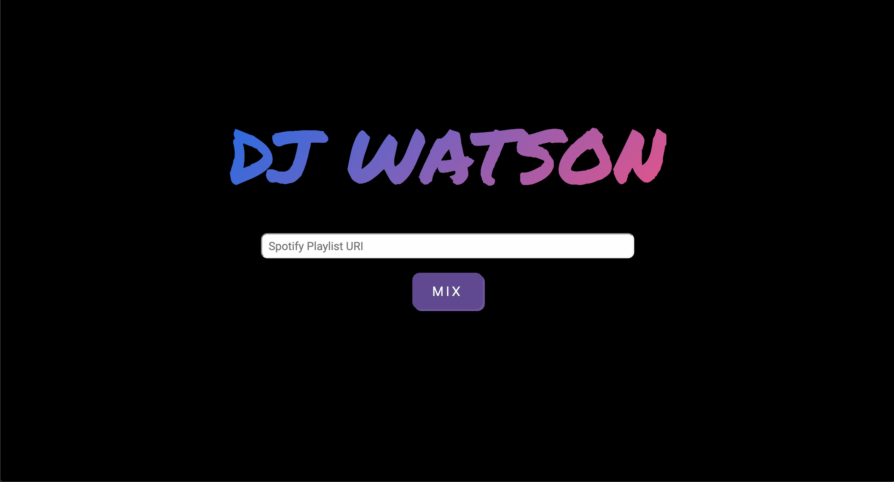
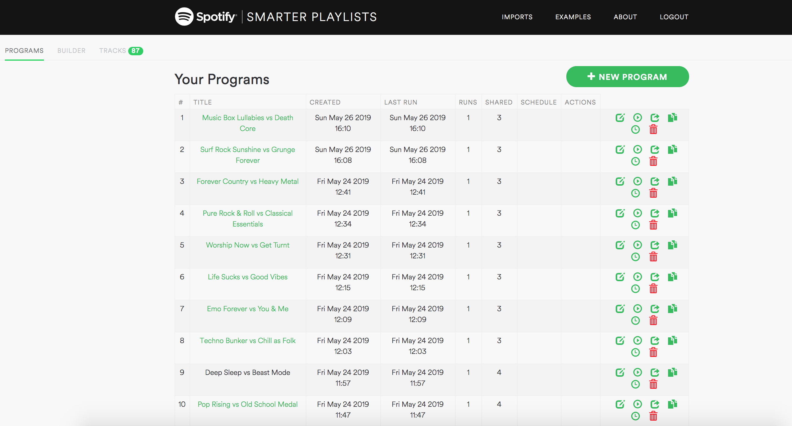
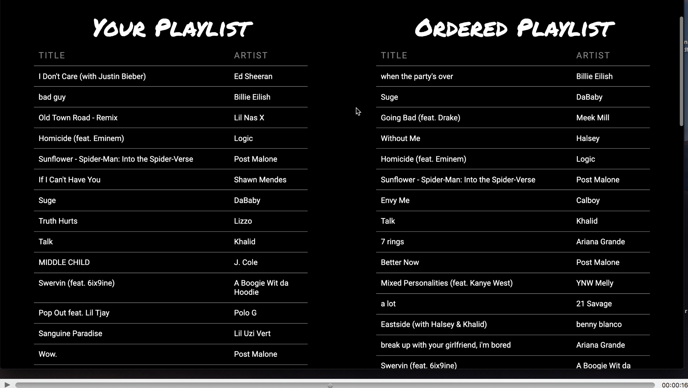

## Final Project: DJ WATSON

COSC 89.11: Cognitive Computing with Watson

Authors: Ryoya Wakamatsu, Ali Hagen, Zac Gottschall, Teddy Ni

DJ WATSON LINK: http://djwatson.surge.sh/

#### Business Model & Motivation

Putting together a perfecly ordered playlist is no easy feat. In fact, creating such an optimal playlist is nearly impossible for a human, particularly when playlists consist of a multitude songs. This projects aims to use cognitive computing in order to make this possible.

DJ WATSON is a paid service and/or feature of a preexisting paid service (such as Spotify) in which users pay either a one time or recurring fee to use DJ Watson’s services. DJ Watson can make paid appearances at events, ranging from small gatherings such as private weddings, to the world’s largest festivals like Coachella. This will not only allow DJ WATSON to earn money from events/shows, but also allows more people to know about the product.

#### Knowledge Source

**Positive data**

For the positve data, we used pairs of songs that are next to each other in albums. This made sense to us since albums are put in a specific order so that the songs sound nicely together.

**Negative data**

In order to create a significant amount of negative data without manually choosing songs, we used a playlist generator from an online application that uses Spotify's API. (http://playlistmachinery.com/) With this, we made playlists that alternate between playlists that have completely opposite types of music to create pairs of songs that would not go well together. For examples, Techno Bunker and Chill as Folk. Here is a view of these playlists in the app:

**Scraper**

#### Tools and Techniques

##### Brain.js

DJ WATSON utilized Brain.js as the alternative to Watson’s API. Brain.js is a Javascript library for Neural Networks.

#### Organization

#### Difficulties Encountered

bias, getting all types of music in, how you know it works- what songs sound good and don't

#### Analysis of Results

Here is an example we used of DJ Watson ordering the playlist United States Top 50 from Spotify:

In order to analyze the results, we looked at specific pairs of songs that Watson did (or didn't) put together.

###### Correct Positive Example: Suge by DaBaby & Going Bad by Meek Mill feat Drake

- This pair of songs sound great together with a very similar vibe of rap and beat style that flows nicely into each other.

###### Incorrect Example: when the party's over by Billie Eilish & Suge by DaBaby
- Very surprisingly, this is the first pair in the ordered playlist so DJ Watson calculated a high percentage match for these songs. However, Billie Eilish's song is much more slow of a tempo and a darker vibe so it does not go together well with Suge by DaBaby.

###### Correct Negative Example: bury a friend by Billie Eilish & Happier by Marshmello and Bastille
- This pair was correctly not placed next to each other in the ordered playlist since bury a friend is a very gloomy song with a beat that dramatically contrasts and does not sound nicely with Happier.

###### Missed Positive Example: Happier by Marshmello and Bastille & Eastside by benny blanco, Halsey and Khalid
- These songs are very similar flow well into each other but DJ Watson unfortunately did not place them next to each other in the playlist. This highlights the way a great pair could be overlooked if its percentage score is only slightly lower than another match.

#### Assessment of resulting system's effectiveness

DJ WATSON worked extremely well when the queried playlist consisted of a wide diversity of music types and genres. Upon inspection of the playlist, the songs were mostly ordered appropriately with songs flowing well from one to the next.

What DJ WATSON did struggle with were playlists that consisted of songs that were similiar to each other. The scores that DJ WATSON assigns to the songs are extremely close and thus, the system fails to order them in an interesting way. It is worth noting, however, that in such a case, the songs already flow well into each other. Another limitation to the system was that there was a hard limit of 50 songs. If a user queried a playlist that consisted of more than 50 songs, DJ WATSON would not be able to generate a reordered list.

#### Points of Improvement and Further Work

There are many points of improvement for DJ WATSON. Firstly, we can personalize the model to the user by taking into account user feedback to retrain the model. Secondly, focusing the algorithm to weigh more heavily on the start and end of songs will allows transitions to be more smooth and natural. Thirdly, incorporating an automatic linkage to Spotify so that the user can play directly from the browser would be a great addition for the user experience. Lastly, we could improve the model further by utilizing different Machine Learning APIs.
